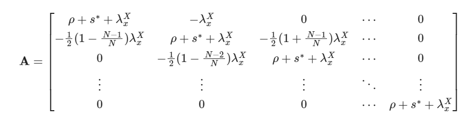
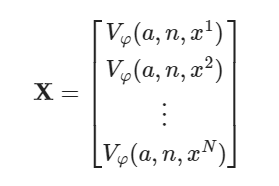
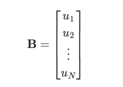
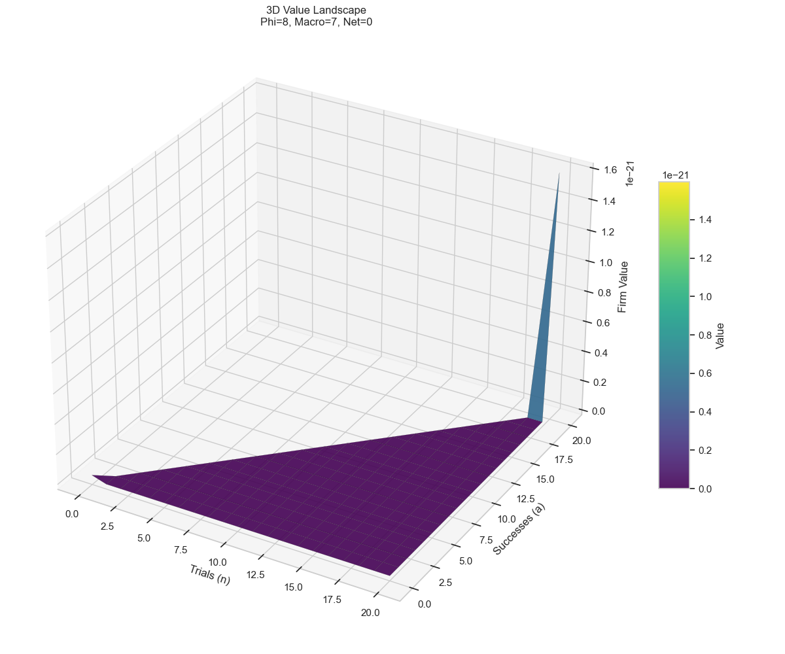
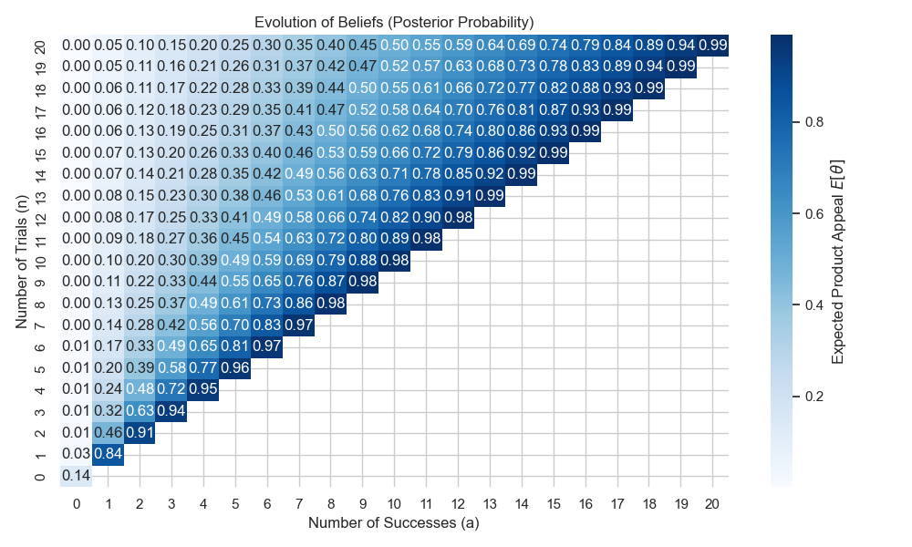
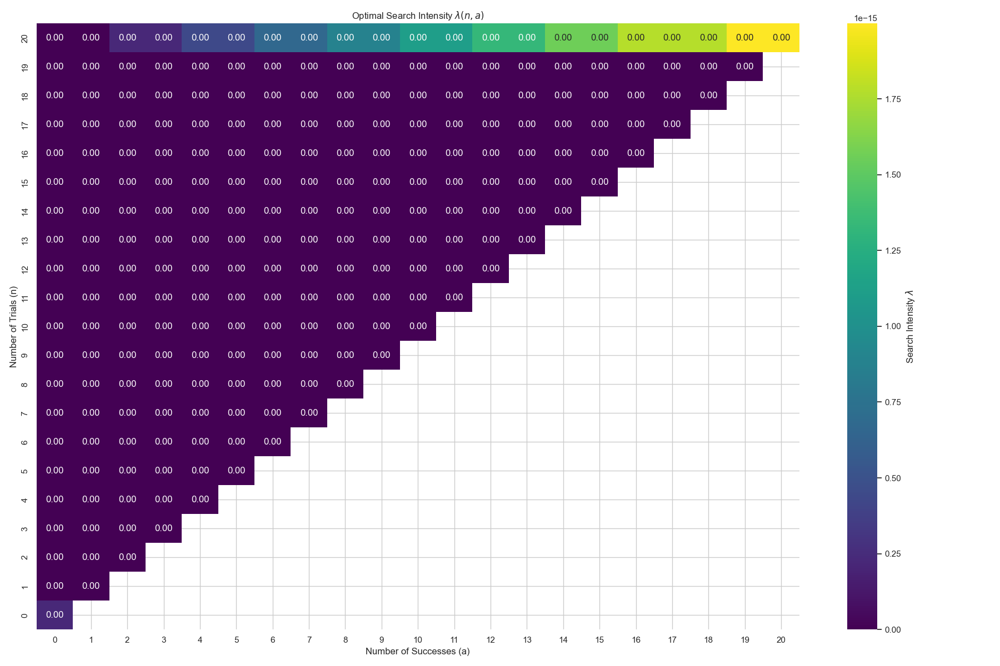

# Replication of Eaton et al (2021)

[](https://www.python.org/)
[](https://colab.research.google.com/github/jruedai08/Eaton-Eslava-Jinkins-Krizan-Tybout-2021-Replication/blob/main/console.ipynb)
This repository contains a **Python implementation** of the dynamic search and learning model from the paper:
> **"A search and learning model of export dynamics"** > *Jonathan Eaton, Marcela Eslava, David Jinkins, C.J. Krizan, James Tybout (2021)*

While the original code was in MATLAB, this project leverages Python's sparse matrix libraries for efficient HJB equation solving and provides an interactive dashboard for exploring the Value Function and Policy Functions.

## 🌟 Key Features

* **Numerical Solver**: Implements the implicit method to solve the HJB equations for both Home and Foreign markets.
* **High Performance**: Solves large-scale state space significantly faster by utilizing sparse linear algebra solvers.
* **Interactive Visualization**: Includes a Jupyter Notebook dashboard to visualize the 5D Value Function $V(n, a, m, \varphi, X)$.

## 📚 Theoretical Framework

The model is about using learning and search costs to explain why few firms engage in exporting and the evolution of match counts among those that do export.

### 1. The State Space

The model solves the firm's optimization problem over a 5-dimensional state space $\{\}$. The corresponding code parameters represent specific economic mechanisms:

* **`n` (Cumulative Trials, $n$)**: Represents the firm's **Information State**.
* **Economic Meaning**: The total number of search attempts a seller has engaged in.
* **Mechanism**: It drives the **Bayesian Learning** process.
* When : The firm is "young" and uncertain. Its posterior belief about market appeal ($\frac{a+\alpha}{n+\alpha+\beta}$) is volatile, creating a high **Option Value** of search.
* When : The firm is "mature." Its beliefs have converged and fixed.

* **`a` (Cumulative Successes, $a$)**:
* **Economic Meaning**: The number of trials that resulted in a successful transaction.
* **Mechanism**: Together with $n$, this forms the sufficient statistic for the firm's posterior belief about its structural demand parameter .

* **`m` (Visibility (Network) Effect, $a^m$)**: Represents the firm's **Physical/Customer State**.
* **Economic Meaning**: The previous number of successful matches the seller serves in the destination market $m$.
* **Mechanism**: It drives the **Visibility (Network) Effect** by lowering the searching cost $c^m(s^m,a^m)=\kappa_0^m \frac{[1+s^m]^{\kappa_1}-(1+\kappa_1 s^m)}{\kappa_1[1+\ln(1+a^m)]^\gamma}$ of reaching *new* customers.
* **Note**: In the model it is exactly the same as $a$. However in the code they are two variables and has different value when learning is mature.

* **`Phi` (Productivity, $\varphi_j$)**:
* **Economics Meaning**: The units of output each worker could produce from the seller $j$, which is time-invariant and known by the seller.
* **Mechanism**: It is drawn from a Log-Normal Distrbution and increases the profit $\pi_\varphi(x,y)=\Pi x\varphi^{\eta-1}y$ given macro statement $x$ and micro demand shock $y$.

* **`x` (Macro statement, $x$)**:
* **Economic Meaning**: The representative of macroeconomics variables affecting all potential buyers in the destination market.
* **Mechanism**: It follows an Ornstein–Uhlenbeck process and affect the value function by changing the expected payoff from a shipment.

### 2. Learning

* Each seller enters the market with an unknown $\theta$, which represents the appeal of its product, drawn from a beta distribution.
* Without the information of their own $\theta$, sellers implement common knowledge about the market as their initial belief of the appeal $\frac{\alpha}{\alpha+\beta}$, and renew their posterior belief $\overline{\theta}_{a,n}$ from the matches they attempt and succeed.

$$
\overline{\theta}_{n,a} = \mathbb{E}[\theta | n, a] = \frac{\alpha + a}{\alpha + \beta + n}
$$

### 3. Searching

* A seller continuously chooses a search intensity $s$ with which it encounters a potential buyer, incurring the instantaneous flow cost $c(s,a)$.
* Given the state $\{a,n,x,\varphi\}$, the return to search includes (1) switch to other macro statement. (2) encounters a buyer and results in a transaction. (3) encounters a buyer but fails to result in a transaction.

$$
V_\varphi(a, n, x) = \max_{s} \frac{1}{\rho + s + \lambda_x^X} [ 
-c(s, a) + \sum_{x' \neq x} q_{xx'}^X V_\varphi(a, n, x')+s \{ \bar{\theta}_{a,n} [\tilde{\pi}_{\varphi}(x) + V_{\varphi}(a+1, n+1, x)] + (1 - \bar{\theta}_{a,n})V_{\varphi}(a, n+1, x) \}]
$$

Where:
* **$s$**: Search intensity.
* **$\rho$**: Discount rate.
* **$c(s,a)$**: Cost of search, which depends on the current network size.
* **$\overline{\theta}_{a,n}$**: The posterior probability of success.
* **$\tilde{\pi}_{\varphi}(x)$**: The capitalized value of finding a *new* client (flow profit + continuation value of the match).
* **$q_{xx'}^X$**: Transition rates for the exogenous macro state $X$.


## 💻 Numerical Implementation

### Implicit Finite Difference Method

* To solve the value function given statement $\{a,n,m,x,\varphi\}$, I rewrite the value function into a matrix form $AX=b$ and implement a backward algorithm to solve the equation system.
* To solve the HJB equation, I implement the backward algorithm and solve the first order condition to derive the optimal search intensity $s$.

$$
\frac{\partial c(s^*,a)}{\partial s}=\overline{\theta}_{a,n}[\tilde{\pi}_\varphi(x)+V_\varphi(a+1,n+1,x)]+(1-\overline{\theta}_{a,n})V_\varphi(a,n+1,x)-V_\varphi(a,n,x)
$$

* Given optimal searching intensity $s^*$, I rewrite the HJB equation into a linear system $\mathbf{A}\mathbf{X}=\mathbf{B}$, where $N$ is the number of grid points.

* **Matrix $\mathbf{A}$ ($N \times N$)**: The sparse transition matrix.

<p align="center">
  
</p>

* **Vector $\mathbf{X}$ ($N \times 1$)**: The value function we solve for.

<p align="center">
  
</p>

* **Vector $\mathbf{B}$ ($N \times 1$)**: The flow payoff and option value vector.
Let the RHS term for state $x^i$ be:

$$
u_i = s^* \{\overline{\theta}_{a,n}[\tilde{\pi}_\varphi(x^i)+V_\varphi(a+1,n+1,x^i)]+(1-\overline{\theta}_{a,n})V_\varphi(a,n+1,x^i)\} - c(s^*,a)
$$

Then:

<p align="center">
  
</p>


## 📊 Interactive Visuals

> **Experience the model dynamics yourself!**

[](https://colab.research.google.com/github/jruedai08/Eaton-Eslava-Jinkins-Krizan-Tybout-2021-Replication/blob/main/console.ipynb)

<p align="center">
  
   
   
</p>

*Click the badge above to interact with these plots live!*

Static images cannot fully capture the complexity of the 5-dimensional value function. We provide an **interactive dashboard** hosted on Google Colab. 

Click the badge above to launch the notebook in your browser (no installation required). You will be able to:

* **🕹️ Rotate and Zoom**: Explore the **3D Value Function** landscape to visually verify the convexity and option value of learning.
* **🎚️ Slice the State Space**: Use sliders to see how the **Optimal Search Policy** $\lambda(n, a)$ or **Value Function** $V_\varphi(a,n,x)$ evolves as productivity $\varphi$, macro statement $x$ or the network size $m$ changes.

*(Note: The dashboard uses `ipywidgets` for interaction. Please run the cells in the notebook to activate the controls.)*

## 🚀 Quick Start

### Prerequisites
Install the required packages:
```bash
pip install -r requirements.txt
